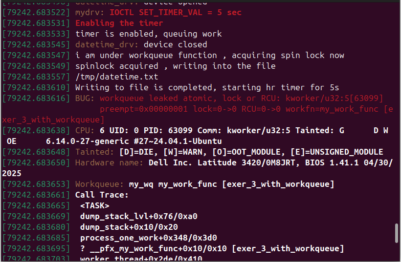

Exercise 3 With Workqueues
(Ioctl + Workqueues + Spinlocks + Writing into a File + HR timers)

1. Setting Up the timer initially to 5s.

2. Firing the enable timer -
    a. Enabletimer = true
    b. Scheduling the tasklet

3. Workqueue Callback Function -
    a. Acquires Spinlock
    b. Write current date/time to file.
    c. Releases the lock

As workqueues runs is process context , and spinlocks runs in atomic context so we cant hold by using hr timers
As we are holding it so we are getting this bug in dmesg ---->

